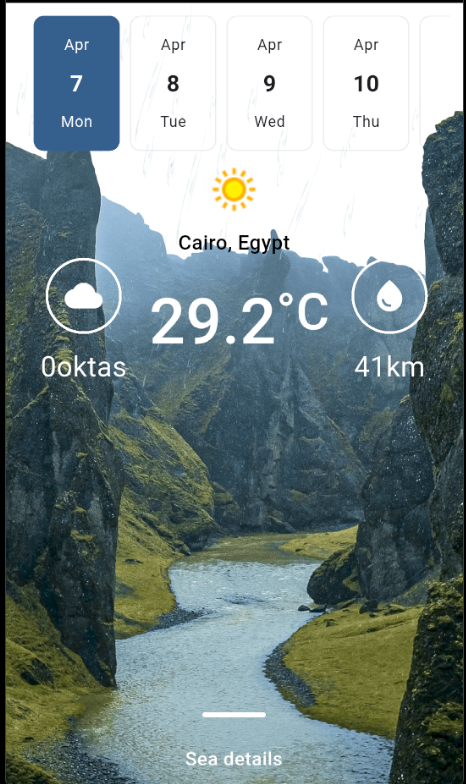
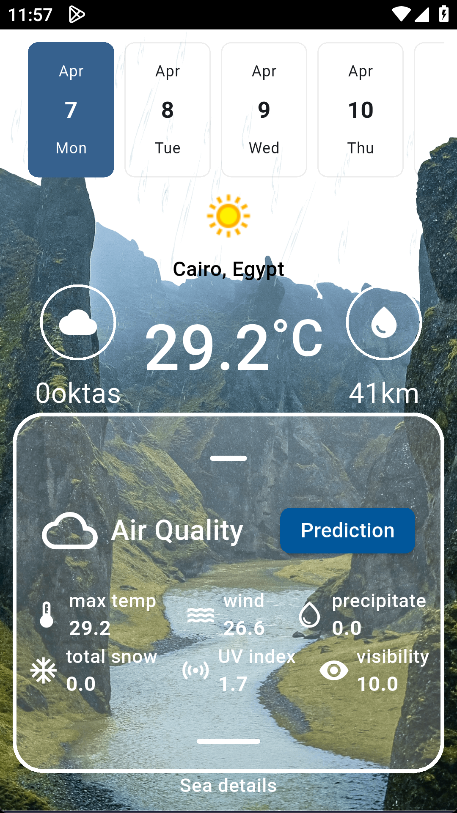
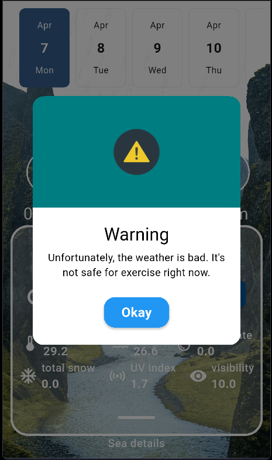

# OutOfNot: Weather Forecast & AI Recommendation App ⛅✨

---

## 📱 App Showcase

### 🔍 Screenshots

| | | |
|--|--|--|
|  |  |  |
|  |  |  |

---
<a href="https://drive.google.com/file/d/1YLx45bhSSMKROtTjBJVEy1LBi9KLOuZV/view?usp=sharing">🎥 Demo Video</a>
## 🧭 Project Overview

- 🔎 **14-Day Weather Forecast:** Get detailed weather updates for the entire week.
- 🤖 **AI-Driven Decision Making:** Sends weather data to an AI model that recommends whether it’s a good idea to go out or not.
- 🧼 **Modern UI:** Clean and responsive user interface for a smooth experience.
- 🔄 **Real-Time API Integration:** Fetches live weather data seamlessly.
- 🧱 **Clean Architecture & Code:** Follows best practices for maintainability and scalability.

---

## 📋 Technical Specifications

| **Aspect**               | **Details**                                |
|--------------------------|---------------------------------------------|
| **Framework**            | Flutter                                     |
| **State Management**     | Cubit (Bloc Architecture)                   |
| **Architecture**         | Clean Architecture (MVVM)                   |
| **API Handling**         | Http                                         |
| **Weather Data Source**  | [WeatherAPI](https://www.weatherapi.com/)   |
| **AI Model API**         | Hosted on [Ploomber Platform](https://ploomber.io/) |

---

## ✨ Features

- 📅 Accurate 14-Day Weather Forecast
- 🌡️ Detailed Weather Insights (Temperature, Humidity, Wind, etc.)
- 🤖 AI-Powered “Go Out or Not” Recommendation
- 🎨 Beautiful & Intuitive User Interface
- 🔄 Real-Time Data Updates

---

## 🚀 Getting Started

### Prerequisites

- Flutter SDK
- Dart SDK
- Android Studio or VS Code

### Installation

1. **Clone the repository**
    ```bash
    git clone https://github.com/EphraimYou/ai-weather
    ```
2. **Install dependencies**
    ```bash
    flutter pub get
    ```
3. **Run the app**
    ```bash
    flutter run
    ```

---

## 🧰 Technology Stack & Dependencies

- Flutter
- Dart
- Cubit (State Management)
- Http (API Handling)
- WeatherAPI
- Ploomber AI Model API
- Golouter (Navigation)
- GetIt (Dependency Injection)
- Firebase Core & Authentication
- Geolocator & Geocoding (Location Services)
- Flutter Secure Storage

---

## 🎨 Design Inspiration

- **UI/UX Design:** Custom-built with modern and minimal aesthetics.

---

## 🙏 Acknowledgments

- Flutter Team
- Dio Package Maintainers
- [WeatherAPI](https://www.weatherapi.com/)
- [Ploomber Platform](https://ploomber.io/)
- AI Model Developers
- Contributors & Open-Source Community

---

## 🤝 Contributing

Contributions, issues, and feature requests are welcome!  
Feel free to check the [issues page](https://github.com/EphraimYou/ai-weather/issues).

---

© 2025 Ephraim, Inc.
